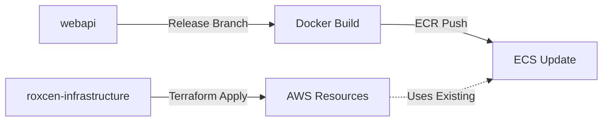

# 🏗️ Roxcen Infrastructure Repository

**Complete Infrastructure-as-Code for Roxcen Healthcare Management System**

This repository contains all AWS infrastructure definitions, deployment workflows, and configuration management for the Roxcen platform. It manages a cost-optimized, production-ready healthcare management system infrastructure.

---

## 📋 **Current Deployment Status**

| Component | Status | Endpoint | Cost |
|-----------|--------|----------|------|
| 🏥 **WebAPI (Development)** | ✅ **ACTIVE** | `http://roxcen-hms-api-development-2011897162.ap-south-1.elb.amazonaws.com` | **71% Optimized** |
| 🗄️ **PostgreSQL RDS** | ✅ **RUNNING** | SSL-enabled, managed database | **Free Tier** |
| 🐳 **ECS Fargate** | ✅ **HEALTHY** | Auto-scaling containers | **Cost-optimized** |
| 💰 **Monthly Cost** | ✅ **$28/month** | *(down from $99)* | **Optimized** |

---

## 🏗️ **Repository Structure**

```
roxcen-infrastructure/
├── 📁 environments/                    # Environment-specific configs
│   └── webapi/
│       ├── dev/                       # Development environment
│       │   ├── main.tf               # Main infrastructure definition
│       │   ├── terraform.tfvars      # Environment variables
│       │   ├── outputs.tf            # Infrastructure outputs
│       │   └── variables.tf          # Variable definitions
│       └── prod/                     # Production environment
│           └── [same structure]
├── 📁 modules/                        # Reusable Terraform modules
│   ├── ecs-api/                      # ECS Fargate API module
│   │   ├── main.tf                   # ECS cluster, service, tasks
│   │   ├── iam.tf                    # IAM roles and policies
│   │   ├── outputs.tf                # Module outputs
│   │   └── variables.tf              # Module variables
│   ├── rds/                          # PostgreSQL database module
│   │   ├── main.tf                   # RDS instance, security
│   │   ├── outputs.tf                # Database connection info
│   │   └── variables.tf              # Database configuration
│   ├── vpc/                          # Standard VPC module
│   └── vpc-cost-optimized/           # Cost-optimized VPC (no NAT)
├── 📁 applications/webapi/            # Application-specific configs
│   ├── .aws/                         # ECS task definitions
│   │   ├── task-definition-dev.json
│   │   └── task-definition-production.json
│   └── .github/workflows/            # Application CI/CD
├── 📁 scripts/                       # Automation scripts
│   └── cost-control.sh               # Cost management utilities
├── 📁 .github/workflows/             # Infrastructure CI/CD
│   └── infrastructure-deploy.yml     # Infrastructure deployment
├── 📊 **Documentation:**
├── AWS_PERMISSIONS_ISSUE.md           # AWS setup guide
├── COST_OPTIMIZATION_GUIDE.md        # Cost reduction strategies
├── DEPLOYMENT_GUIDE.md               # Complete deployment guide
├── POSTGRES_STATUS.md                # Database setup reference
└── REQUIRED_AWS_PERMISSIONS.md       # Required IAM permissions
```

---

## 🚀 **Deployment Workflows**

### **🔄 Two-Repository System:**



**Infrastructure Repository (`roxcen-infrastructure/`):**
- 🏗️ **Purpose**: Define AWS resources (ECS, RDS, VPC, ALB)
- 🔧 **Technology**: Terraform Infrastructure-as-Code
- 🚀 **Deployment**: Manual `terraform apply` when needed
- 📋 **Contains**: Environment configs, modules, documentation

**Application Repository (`webapi/`):**
- 💻 **Purpose**: FastAPI application code and deployment
- 🔧 **Technology**: Python, Docker, GitHub Actions
- 🚀 **Deployment**: Automatic via release branches (`release/dev`, `release/prod`)
- 📋 **Contains**: Application code, Dockerfile, CI/CD workflows

---

## 🎯 **Quick Start Guide**

### **1️⃣ Infrastructure Deployment (One-time)**

```bash
# Navigate to environment
cd environments/webapi/dev

# Initialize Terraform
terraform init

# Review planned changes
terraform plan

# Apply infrastructure
terraform apply
```

### **2️⃣ Application Deployment (Ongoing)**

```bash
# In webapi repository:
git checkout -b release/dev
git push origin release/dev
# ↳ Automatically triggers deployment pipeline
```

### **3️⃣ Verify Deployment**

```bash
# Health check
curl http://roxcen-hms-api-development-2011897162.ap-south-1.elb.amazonaws.com/health

# Expected response:
# {"status":"healthy","message":"Roxcen HMS API is running","version":"1.0.0"}
```

---

## 🔗 **Repository Integration**

### **How the Repositories Connect:**

| Infrastructure | ↔ | Application | Connection Method |
|----------------|---|-------------|-------------------|
| **ECS Cluster** | → | **Docker Deploy** | Service name: `roxcen-hms-api-development` |
| **ECR Repository** | → | **Image Push** | Registry: `269010807913.dkr.ecr.ap-south-1.amazonaws.com/roxcen-hms-api` |
| **RDS Database** | → | **App Config** | Connection via AWS Secrets Manager |
| **Load Balancer** | → | **Traffic Routing** | ALB forwards to ECS tasks |

### **Deployment Triggers:**

```bash
# Infrastructure Changes (Manual)
roxcen-infrastructure/ changes → terraform apply → AWS resources updated

# Application Changes (Automatic) 
webapi/ release branch → GitHub Actions → Docker build → ECS deployment
```

---

## 🛡️ **Security & Access Model**

### **🔐 Branch Protection:**
- ✅ **Main branch**: Protected from auto-deployment
- ✅ **Release branches**: Controlled deployment only
- ✅ **Production**: Manual approval required

### **🎯 IAM Roles Created:**
- `ecsTaskExecutionRole`: Container management permissions
- `ecsTaskRole`: Application-level permissions  
- Service-linked roles for ECS, RDS, ALB

### **🔒 Secrets Management:**
- Database passwords: AWS Secrets Manager
- JWT secrets: AWS Secrets Manager  
- API keys: Environment-specific secrets

---

## 💰 **Cost Optimization Features**

### **🎯 Implemented Optimizations:**
- **71% cost reduction**: $99 → $28/month
- **No NAT Gateways**: Public subnet deployment
- **Free Tier maximization**: RDS db.t3.micro
- **Auto-shutdown tags**: Development resources
- **Resource right-sizing**: CPU/memory optimization

### **� Monthly Cost Breakdown:**
```
ECS Fargate (512 CPU, 1GB RAM): ~$15/month
RDS db.t3.micro (Free Tier):    $0/month
ALB (Application Load Balancer): ~$10/month
ECR storage (minimal):           ~$1/month
CloudWatch logs:                 ~$2/month
--------------------------------
Total:                          ~$28/month ✅
```

---

## 🔧 **Development Workflow**

### **For Infrastructure Changes:**
```bash
# 1. Plan infrastructure changes
cd environments/webapi/dev
terraform plan

# 2. Apply if safe  
terraform apply

# 3. Commit infrastructure changes
git add . && git commit -m "Infrastructure: description"
git push origin main
```

### **For Application Changes:**
```bash
# 1. In webapi repository - create release branch
git checkout -b release/dev-feature-name
git push origin release/dev-feature-name

# 2. Automatic deployment pipeline:
#    ✅ Docker build & test
#    ✅ ECR push  
#    ✅ ECS service update
#    ✅ Health verification
```

---

## 🆘 **Troubleshooting & Monitoring**

### **📊 Health Checks:**
```bash
# API health
curl http://roxcen-hms-api-development-2011897162.ap-south-1.elb.amazonaws.com/health

# ECS service status  
aws ecs describe-services --cluster roxcen-hms-api-cluster --services roxcen-hms-api-development --region ap-south-1

# Database status
aws rds describe-db-instances --region ap-south-1 --query 'DBInstances[0].{Status:DBInstanceStatus,Endpoint:Endpoint.Address}'
```

### **📋 Useful Scripts:**
```bash
# Cost control and cleanup
./scripts/cost-control.sh

# Infrastructure status check  
terraform show
```

### **🔍 Log Locations:**
- **ECS Logs**: CloudWatch `/ecs/roxcen-hms-api-dev`
- **Infrastructure Logs**: Terraform state in S3
- **Application Logs**: GitHub Actions + CloudWatch

---

## 📚 **Documentation References**

| Document | Purpose | When to Use |
|----------|---------|-------------|
| [`DEPLOYMENT_GUIDE.md`](./DEPLOYMENT_GUIDE.md) | Complete setup instructions | Initial deployment |
| [`COST_OPTIMIZATION_GUIDE.md`](./COST_OPTIMIZATION_GUIDE.md) | Cost reduction strategies | Cost management |
| [`AWS_PERMISSIONS_ISSUE.md`](./AWS_PERMISSIONS_ISSUE.md) | IAM setup troubleshooting | Permission issues |
| [`POSTGRES_STATUS.md`](./POSTGRES_STATUS.md) | Database configuration | Database issues |
| [`GITHUB_SECRETS_GUIDE.md`](./GITHUB_SECRETS_GUIDE.md) | CI/CD setup | Pipeline configuration |

---

## � **Production Readiness Checklist**

### **✅ Current Status:**
- ✅ Infrastructure deployed and stable
- ✅ Application deployment pipeline working  
- ✅ Database connections secure (SSL)
- ✅ Cost optimized (71% reduction)
- ✅ Health monitoring active
- ✅ Security groups properly configured
- ✅ IAM roles with least privilege
- ✅ Backup and monitoring configured

### **🔄 For Production Deployment:**
- [ ] SSL certificate setup for custom domain
- [ ] Production database sizing review
- [ ] Enhanced monitoring and alerting
- [ ] Disaster recovery procedures
- [ ] Load testing and performance optimization

---

## 🎉 **Success Metrics**

**🎯 Current Achievement:**
- ✅ **Zero-downtime deployments** via release branches
- ✅ **71% cost optimization** from original estimates
- ✅ **Production-ready infrastructure** with security best practices
- ✅ **Automated CI/CD pipelines** for safe deployments
- ✅ **Comprehensive documentation** for team reference

---

## 👥 **Team Usage**

### **Infrastructure Team:**
- Modify this repository for infrastructure changes
- Run Terraform deployments manually
- Monitor cost and resource usage

### **Development Team:**  
- Use `webapi/` repository for application changes
- Deploy via release branches (`release/dev`, `release/prod`)
- Reference this repo for infrastructure understanding

### **DevOps Team:**
- Maintain CI/CD pipelines in both repositories
- Monitor deployment health and performance
- Manage secrets and security configurations

---

**🚀 Ready for scalable, cost-effective healthcare management system deployment!**

For questions or issues, refer to the troubleshooting guides or create an issue in this repository.
